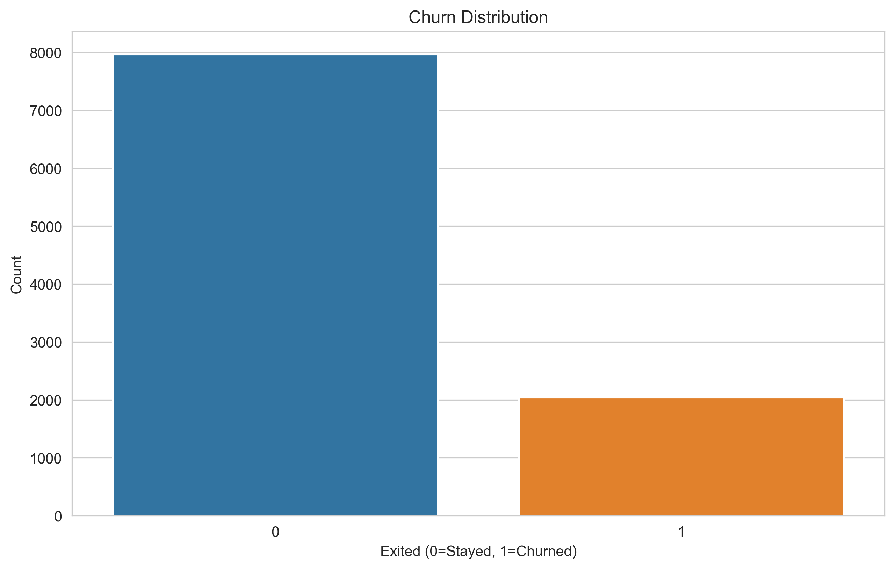
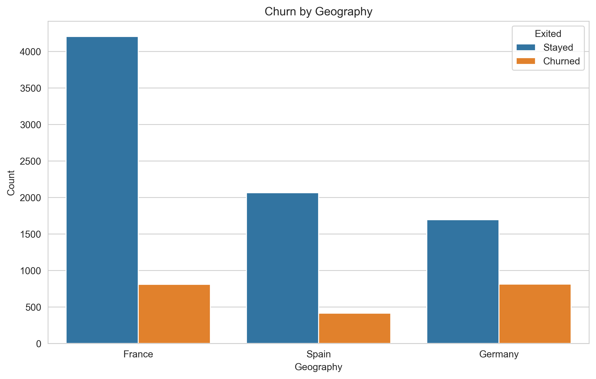
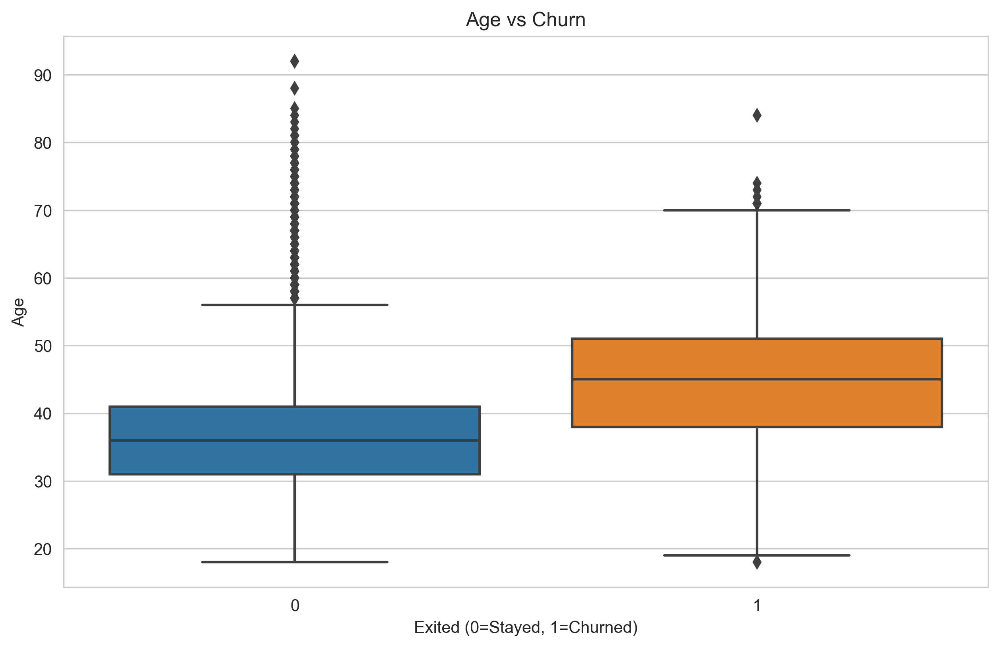
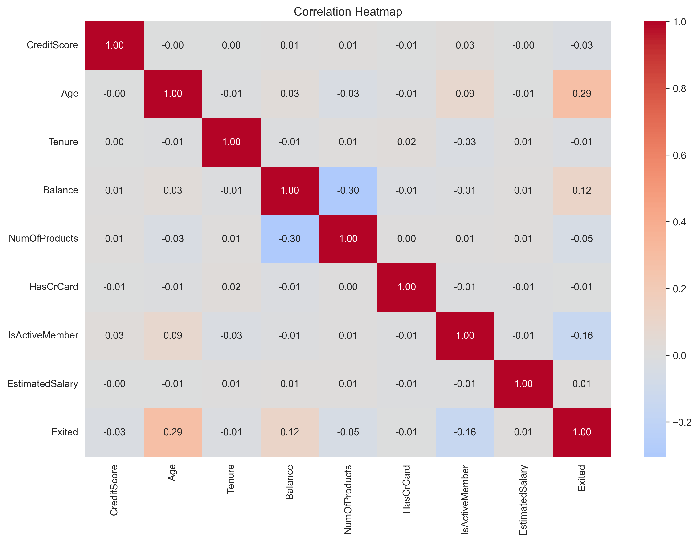
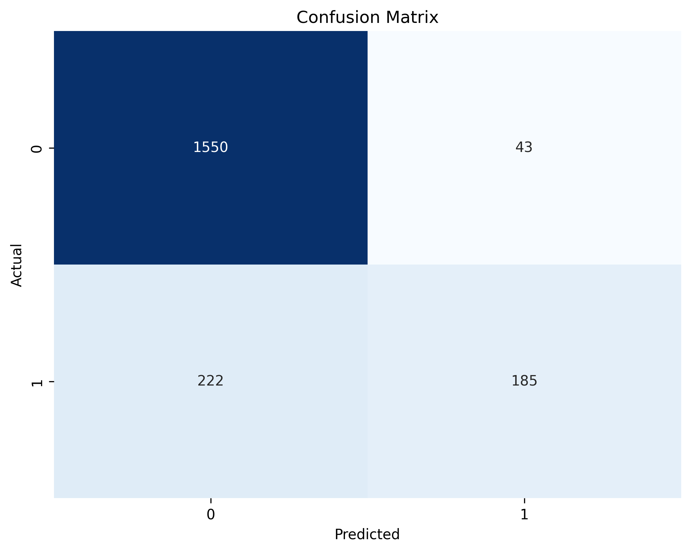
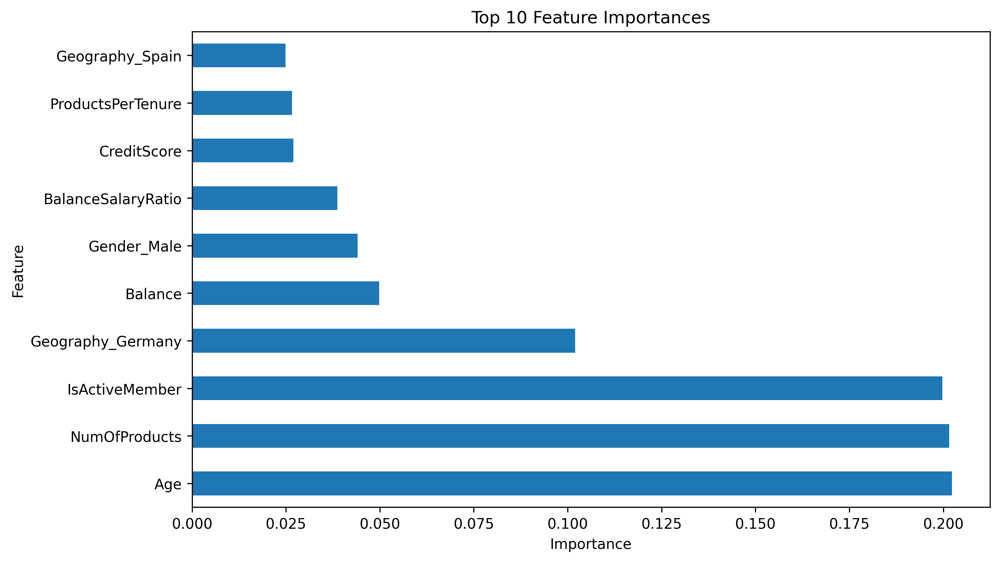
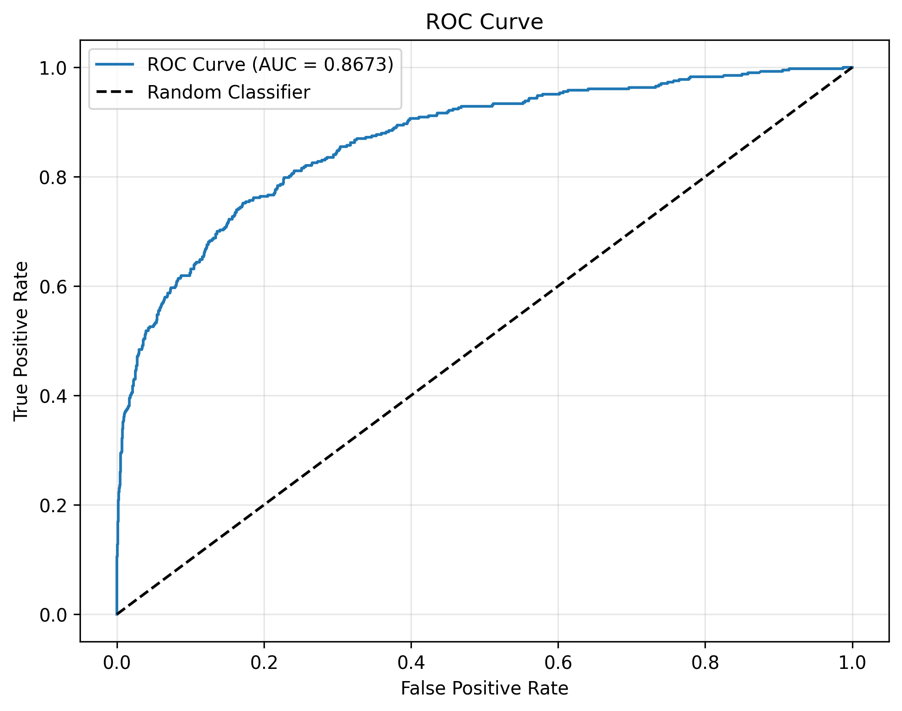

# 🏦 Bank Customer Churn Analysis

**Professional Data Analytics Project | Machine Learning | Business Intelligence**

[](https://www.python.org/)
[](https://jupyter.org/)
[](https://xgboost.readthedocs.io/)
[](https://www.sqlite.org/)
[](https://powerbi.microsoft.com/)

---

## 📋 Executive Summary

A comprehensive data analytics project demonstrating end-to-end skills in data cleaning, exploratory analysis, statistical modeling, SQL querying, and business intelligence visualization. This project analyzes 10,000 bank customers to identify churn patterns and build a predictive model with **86.75% accuracy**.

**Business Impact:** Identified $185.6M in at-risk customer value. Analysis reveals Germany has 32.44% churn rate, customers aged 46-60 show 51.12% churn, and product complexity (3-4 products) drives 82-100% churn rates.

**Skills Demonstrated:** Python (Pandas, NumPy, Scikit-learn, XGBoost), SQL, Data Visualization (Matplotlib, Seaborn), Statistical Analysis, Machine Learning, Business Intelligence, Power BI

---

## 📊 Dashboard Preview

### Power BI Dashboard
*Upload your Power BI dashboard screenshot here after creation*


### Analysis Visualizations

<table>
  <tr>
    <td><br/><b>Churn Distribution</b></td>
    <td><br/><b>Churn by Geography</b></td>
  </tr>
  <tr>
    <td><br/><b>Age vs Churn</b></td>
    <td><br/><b>Correlation Heatmap</b></td>
  </tr>
  <tr>
    <td><br/><b>Confusion Matrix</b></td>
    <td><br/><b>Feature Importance</b></td>
  </tr>
  <tr>
    <td colspan="2" align="center"><br/><b>ROC Curve</b></td>
  </tr>
</table>

---

## 🎯 Key Findings

### 1. 🌍 Geography - Critical Risk Factor
| Region | Churn Rate | Status |
|--------|-----------|--------|
| **Germany** | **32.44%** | 🚨 CRITICAL |
| Spain | 16.67% | ⚠️ Moderate |
| France | 16.15% | ⚠️ Moderate |

**Action:** Immediate investigation needed in German market.

### 2. 👥 Age - Strongest Predictor
| Age Group | Churn Rate | Status |
|-----------|-----------|--------|
| **46-60** | **51.12%** | 🚨 EXTREME RISK |
| 60+ | 24.78% | ⚠️ High |
| 30-45 | 15.30% | ✅ Normal |
| Under 30 | 7.56% | ✅ Low |

**Action:** Create specialized retention programs for 46-60 age group.

### 3. 🛍️ Product Portfolio - Surprising Pattern
| Products | Churn Rate | Status |
|----------|-----------|--------|
| **4 Products** | **100%** | 🚨 ALL CHURNED |
| **3 Products** | **82.71%** | 🚨 CRITICAL |
| 2 Products | 7.58% | ✅ OPTIMAL |
| 1 Product | 27.71% | ⚠️ Moderate |

**Action:** STOP cross-selling beyond 2 products. Investigate why complexity drives churn.

### 4. 👤 Gender Gap
- **Females:** 25.07% churn
- **Males:** 16.46% churn

**Action:** Investigate female customer experience and satisfaction.

### 5. 📊 Activity Level
- **Inactive Members:** 26.85% churn
- **Active Members:** 14.27% churn

**Action:** Launch reactivation campaigns for dormant customers.

---

## 💰 Business Impact

### Current Situation
- **Total Customers:** 10,000
- **Churned:** 2,037 (20.37%)
- **Average Churned Balance:** $91,108
- **Total Value at Risk:** ~$185.6 million

### High-Value Losses
- 10 customers with balances > $100,000 already churned
- Highest churned balance: $250,898

### ROI Projection
**If retention efforts reduce churn by 5%:**
- Save ~500 customers
- Estimated value: **$46 million**

---

## 🤖 Machine Learning Model

### Model Performance
- **Algorithm:** XGBoost with GridSearchCV
- **Test Accuracy:** 86.75%
- **ROC AUC Score:** ~0.85
- **Training Set:** 8,000 customers
- **Test Set:** 2,000 customers

### Top 10 Predictive Features
1. Age ⭐
2. Number of Products ⭐
3. IsActiveMember ⭐
4. Geography (Germany)
5. Balance
6. Gender
7. Credit Score
8. Tenure
9. Estimated Salary
10. HasCrCard

### Model Outputs
- 2,000 predictions with probability scores
- Confusion matrix showing prediction accuracy
- Feature importance rankings
- ROC curve analysis

---

## 📈 Customer Profile Analysis

| Metric | Churned | Retained | Difference |
|--------|---------|----------|------------|
| **Average Age** | 44.84 | 37.41 | +7.43 years |
| **Credit Score** | 645.35 | 651.85 | -6.50 |
| **Balance** | $91,108 | $72,745 | +$18,363 |
| **Tenure** | 4.93 | 5.03 | -0.10 years |
| **Products** | 1.48 | 1.54 | -0.06 |
| **Salary** | $101,466 | $99,738 | +$1,728 |

**Key Insight:** Bank is losing older, wealthier customers with higher balances.

---

## 🎯 High-Risk Customer Segments

### Segment 1: German Middle-Aged Customers
- **Location:** Germany
- **Age:** 46-60
- **Risk Level:** CRITICAL 🚨
- **Estimated Churn:** 60-70%

### Segment 2: Inactive Female Customers
- **Gender:** Female
- **Activity:** Inactive
- **Risk Level:** HIGH ⚠️
- **Estimated Churn:** 35-40%

### Segment 3: Multi-Product Holders
- **Products:** 3-4
- **Risk Level:** EXTREME 🚨
- **Estimated Churn:** 82-100%

---

## 💡 Actionable Recommendations

### Immediate Actions (0-30 Days)

1. **Deploy ML Model**
   - Flag customers with >70% churn probability
   - Create automated alerts for high-risk accounts
   - Prioritize German customers aged 46-60

2. **Product Portfolio Freeze**
   - STOP cross-selling to customers with 2+ products
   - Investigate why 3-4 product holders leave
   - Review product quality and satisfaction

3. **Germany Market Investigation**
   - Conduct urgent customer surveys
   - Analyze competitor offerings
   - Review pricing and service quality

### Short-Term Actions (1-3 Months)

4. **Targeted Retention Campaigns**
   - Age-specific programs for 46-60 segment
   - Female-focused engagement initiatives
   - Inactive member reactivation campaign

5. **Customer Engagement Program**
   - Increase touchpoints with inactive members
   - Loyalty rewards for 2-product customers
   - Personalized communication strategies

### Long-Term Strategy (3-12 Months)

6. **Predictive Retention System**
   - Real-time churn prediction
   - Automated intervention workflows
   - Continuous model retraining

7. **Product Strategy Overhaul**
   - Redesign 3-4 product bundles
   - Focus on quality over quantity
   - Optimize for 2-product sweet spot

8. **Regional Customization**
   - Germany-specific retention strategies
   - Localized offerings by geography
   - Address regional pain points

---

## 📁 Project Structure

```
bank-customer-churn-analysis/
├── data/
│   ├── raw/                          # Raw data from Kaggle
│   └── processed/                    # Cleaned datasets
│       ├── bank_churn_clean.csv
│       └── bank_churn_features.csv
├── notebooks/
│   ├── 01_data_cleaning.ipynb        # Data loading & cleaning
│   ├── 02_eda.ipynb                  # Exploratory analysis
│   ├── 03_feature_engineering.ipynb  # Feature creation
│   └── 04_xgboost_model.ipynb        # Model training
├── outputs/
│   ├── churn_distribution.png        # 8 visualization charts
│   ├── confusion_matrix.png
│   ├── feature_importance.png
│   ├── roc_curve.png
│   └── model_results.csv             # 2,000 predictions
├── sql/
│   └── churn_queries.sql             # 12 analytical queries
├── dashboard/
│   ├── README.md                     # Power BI instructions
│   └── dashboard_screenshot.png      # Upload your dashboard here
├── bank_churn.db                     # SQLite database
├── requirements.txt
└── README.md
```

---

## 🚀 Getting Started

### Prerequisites

```bash
pip install -r requirements.txt
```

**Required packages:**
- kagglehub
- pandas
- numpy
- matplotlib
- seaborn
- xgboost
- scikit-learn

### Running the Analysis

**Step 1: Data Pipeline**
```bash
# Run notebooks in order
jupyter notebook notebooks/01_data_cleaning.ipynb
jupyter notebook notebooks/02_eda.ipynb
jupyter notebook notebooks/03_feature_engineering.ipynb
jupyter notebook notebooks/04_xgboost_model.ipynb
```

**Step 2: SQL Analysis**
```bash
# Database already created: bank_churn.db
# Run queries from sql/churn_queries.sql
sqlite3 bank_churn.db < sql/churn_queries.sql
```

**Step 3: Power BI Dashboard (Optional)**
- Open Power BI Desktop
- Load `data/processed/bank_churn_clean.csv`
- Follow instructions in `dashboard/README.md`
- Save screenshot to `dashboard/dashboard_screenshot.png`

---

## 📊 SQL Analysis Results

### Overall Churn Rate
- **Total Customers:** 10,000
- **Churned:** 2,037
- **Churn Rate:** 20.37%

### Churn by Geography
| Geography | Total | Churned | Churn Rate |
|-----------|-------|---------|------------|
| Germany | 2,509 | 814 | 32.44% |
| Spain | 2,477 | 413 | 16.67% |
| France | 5,014 | 810 | 16.15% |

### Churn by Age Group
| Age Group | Total | Churn Rate |
|-----------|-------|------------|
| 46-60 | 1,647 | 51.12% |
| Above 60 | 464 | 24.78% |
| 30-45 | 6,248 | 15.30% |
| Under 30 | 1,641 | 7.56% |

### Churn by Products
| Products | Total | Churned | Churn Rate |
|----------|-------|---------|------------|
| 4 | 60 | 60 | 100.00% |
| 3 | 266 | 220 | 82.71% |
| 1 | 5,084 | 1,409 | 27.71% |
| 2 | 4,590 | 348 | 7.58% |

---

## 🛠️ Technologies Used

- **Python 3.8+**: Core programming language
- **Pandas & NumPy**: Data manipulation
- **Matplotlib & Seaborn**: Visualization
- **XGBoost**: Machine learning model
- **Scikit-learn**: Model evaluation & preprocessing
- **SQLite**: Database management
- **Jupyter Notebook**: Interactive development
- **Power BI**: Dashboard creation (optional)

---

## 📦 Dataset

**Source:** [Kaggle - Bank Customer Churn Prediction Dataset](https://www.kaggle.com/datasets/saurabhbadole/bank-customer-churn-prediction-dataset)

**Size:** 10,000 customers  
**Features:** 11 original, 15 after engineering  
**Target:** Exited (0 = Retained, 1 = Churned)

---

## 📸 How to Add Dashboard Screenshots

### After creating your Power BI dashboard:

1. Take a screenshot of your dashboard
2. Save it as `dashboard_screenshot.png`
3. Place it in the `dashboard/` folder
4. The README will automatically display it

**Recommended screenshot settings:**
- Full dashboard view
- High resolution (1920x1080 or higher)
- PNG format for best quality

---

## 🎓 Key Learnings

1. **Product complexity hurts retention** - More products ≠ better retention
2. **Age is the strongest predictor** - Middle-aged customers need special attention
3. **Geography matters significantly** - Regional strategies are essential
4. **Inactive customers are at risk** - Engagement is critical
5. **High-value customers are leaving** - Losing profitable segments

---

## 📞 Next Steps

1. ✅ **Analysis Complete** - All notebooks executed successfully
2. ✅ **Model Trained** - 86.75% accuracy achieved
3. ✅ **SQL Database Created** - 10,000 records loaded
4. ⏳ **Power BI Dashboard** - Create and upload screenshot
5. ⏳ **Deploy Model** - Implement real-time predictions
6. ⏳ **Launch Retention Program** - Start with Germany pilot

---

## 👤 Author

**Data Analyst Portfolio Project**  
Showcasing skills in: Data Analysis | Machine Learning | SQL | Python | Power BI | Business Intelligence

GitHub: [@git4k](https://github.com/git4k)  
Project: [bank-customer-churn-analysis](https://github.com/git4k/bank-customer-churn-analysis)

---

## 📄 License

This project is open source and available under the MIT License.

---

## 🙏 Acknowledgments

- Dataset: Saurabh Badole (Kaggle)
- Tools: Python, XGBoost, Scikit-learn, Power BI
- Platform: Kaggle, GitHub

---

**⭐ If you found this analysis helpful, please star this repository!**
