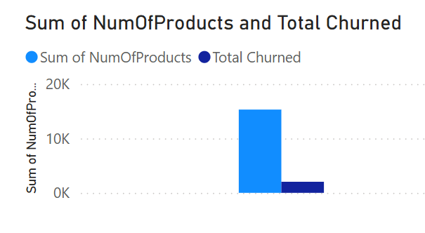
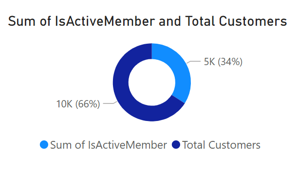
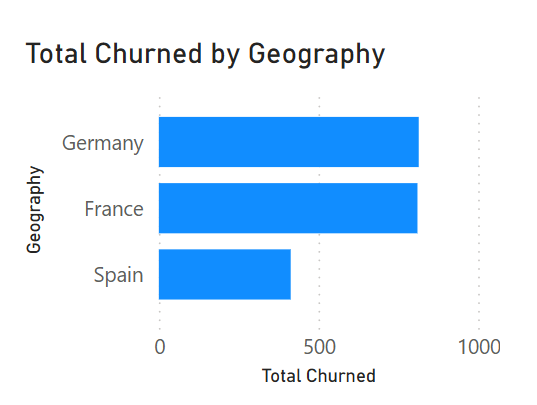

# Bank Customer Churn Analysis

A data analytics project analyzing 10,000 bank customers to understand churn patterns and build a machine learning model to predict which customers are likely to leave.

**Tech Stack:** Python, Pandas, SQL, XGBoost, Power BI, Matplotlib, Seaborn

---

## Power BI Dashboard

<table>
  <tr>
    <td></td>
    <td></td>
  </tr>
  <tr>
    <td colspan="2" align="center"></td>
  </tr>
</table>

---

## Analysis Visualizations

<table>
  <tr>
    <td align="center"><br/><b>Churn Distribution</b><br/>20.37% overall churn rate</td>
    <td align="center"><br/><b>Churn by Geography</b><br/>Germany leads at 32.44%</td>
  </tr>
  <tr>
    <td align="center"><br/><b>Age vs Churn</b><br/>Ages 46-60 at 51.12% churn</td>
    <td align="center"><br/><b>Correlation Heatmap</b><br/>Age & Geography strongest predictors</td>
  </tr>
  <tr>
    <td align="center"><br/><b>Confusion Matrix</b><br/>86.75% model accuracy</td>
    <td align="center"><br/><b>Feature Importance</b><br/>Top predictors: Age, Products, Activity</td>
  </tr>
  <tr>
    <td align="center" colspan="2"><br/><b>ROC Curve</b><br/>AUC ~0.85</td>
  </tr>
</table>

---

## Key Findings

**Geography**
| Region | Churn Rate |
|--------|-----------|
| Germany | 32.44% |
| Spain | 16.67% |
| France | 16.15% |

**Age Group**
| Age Group | Churn Rate |
|-----------|-----------|
| 46-60 | 51.12% |
| Above 60 | 24.78% |
| 30-45 | 15.30% |
| Under 30 | 7.56% |

**Number of Products**
| Products | Churn Rate |
|----------|-----------|
| 4 | 100.00% |
| 3 | 82.71% |
| 1 | 27.71% |
| 2 | 7.58% |

**Other Findings**
- Inactive members churn at 26.85% vs 14.27% for active members
- Female customers churn at 25.07% vs 16.46% for males
- Churned customers have higher average balance ($91,108 vs $72,745)

---

## ML Model Results

- **Algorithm:** XGBoost with GridSearchCV hyperparameter tuning
- **Accuracy:** 86.75%
- **ROC AUC:** ~0.85
- **Train/Test Split:** 80/20

Top features: Age, NumOfProducts, IsActiveMember, Geography, Balance

---

## Project Structure

```
bank-customer-churn-analysis/
├── data/
│   ├── raw/
│   └── processed/
├── notebooks/
│   ├── 01_data_cleaning.ipynb
│   ├── 02_eda.ipynb
│   ├── 03_feature_engineering.ipynb
│   └── 04_xgboost_model.ipynb
├── sql/
│   └── churn_queries.sql
├── dashboard/
├── outputs/
├── bank_churn.db
└── requirements.txt
```

---

## How to Run

```bash
pip install -r requirements.txt

# Run notebooks in order
jupyter notebook notebooks/01_data_cleaning.ipynb
jupyter notebook notebooks/02_eda.ipynb
jupyter notebook notebooks/03_feature_engineering.ipynb
jupyter notebook notebooks/04_xgboost_model.ipynb
```

---

## Dataset

Source: [Kaggle - Bank Customer Churn Prediction Dataset](https://www.kaggle.com/datasets/saurabhbadole/bank-customer-churn-prediction-dataset)

10,000 customers | 11 features | Target: Exited (0 = Retained, 1 = Churned)
